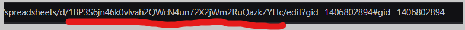
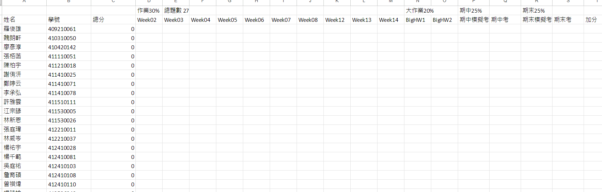

# AutoScore

AutoScore 是一個自動化工具，用於從 DOMjudge 比賽中提取積分數據，並將其更新至 Google Sheets。專案旨在簡化比賽成績的管理流程，並提供可視化和便捷的操作介面。

## 功能

1. **從 DOMjudge 獲取數據**：
   - 獲取隊伍列表、比賽列表，以及指定比賽的積分榜。
2. **從 Google Sheets 獲取數據**：
   - 獲取學生名單與對應的表格欄位。
3. **映射比賽與表格欄位**：
   - 使用者可通過圖形化介面（Tkinter）手動選擇比賽與表格的映射關係。
4. **自動更新成績**：
   - 根據 DOMjudge 的比賽結果，將分數自動寫入 Google Sheets。

## 專案結構

```plaintext
AutoScore/
│
├── main.py                   # 主程式入口
├── config.py                 # 配置檔案（Google Sheets 和 DOMjudge 的設定）
├── models/                   # 型態定義
│   └── types.py              # 定義 TypedDict 型態
├── utils/                    # 工具模組
│   ├── domjudge.py           # DOMjudge 相關邏輯
│   ├── google_sheet.py       # Google Sheets 相關操作
│   └── tkinter_ui.py         # Tkinter UI 操作邏輯
├── .env                      # 環境變數（不應提交到版本控制）
├── .gitignore                # 忽略規則
├── requirements.txt          # Python 套件依賴清單
└── README.md                 # 說明文件
```

## 安裝與配置

### 1. 安裝依賴

請確保你的環境中已安裝 Python 3.8 或以上版本，並執行以下命令安裝所需的依賴套件：

```bash
pip install -r requirements.txt
```

### 2. 配置環境變數

在專案根目錄創建 \'.env\' 文件
按照.env.example 的格式填入 Domjudge 網址, 帳號，密碼

可以參照這篇取得KEY，存在目前資料夾內
[蛤！原來串接Google Sheet API 那麼簡單? - iT 邦幫忙](https://ithelp.ithome.com.tw/articles/10234325)

SHEET_ID 則是


## 使用方式

1. 要先確保Google sheet內長成這個樣子
   
   A2 是姓名, B2 是學號, 總分, 隨後就是你要打分數項目

學生匯入的部分可以使用 getStudent.py
配合eCourse2 下載的學生資料(.csv結尾)
就可自動填入所有學生名字及學號

2. 選擇比賽與欄位映射
   當執行main.py 之後會彈出一個圖形化界面（Tkinter），讓你選擇 DOMjudge 比賽與 Google Sheet 欄位的對應關係
   完成選擇後，點擊 提交。
3. 自動更新分數
   提交後，工具將執行以下操作：

- 獲取 DOMjudge 的比賽數據與積分榜。
- 解析數據並與學生名單進行映射。
- 將比賽分數自動更新到對應的 Google Sheet 欄位中。

## 下載題本
如果期末評鑑資料要繳交時，可使用Download_Problem.py 來下載題本
執行後會跳出視窗，選擇你要下載的 Contest 後就會自動下載了
選擇時可多選
下載後就會存放在根目錄的 Problem 資料夾內

## 聯絡方式

如有任何問題或建議，請聯絡：

- **Email**: lindanceleaf@gmail.com
